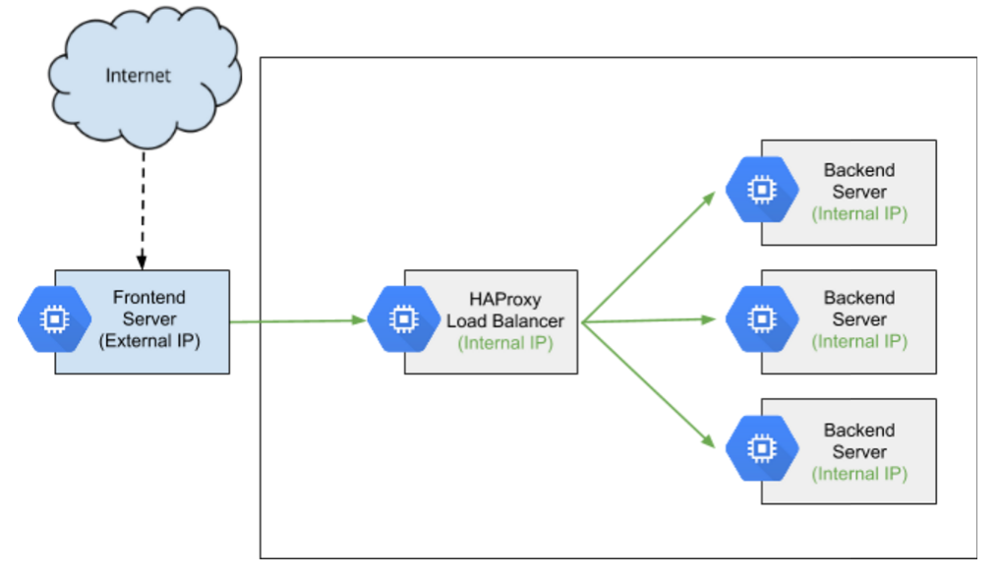
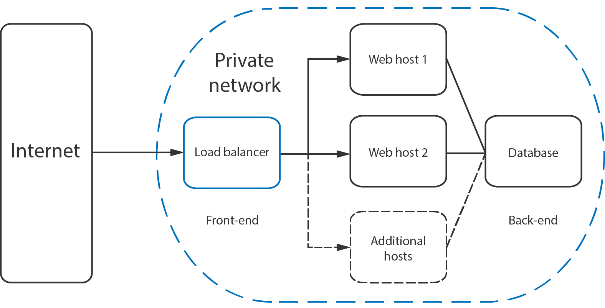

##	HAProxy for Load Balancing :

*	HAProxy allows a webserver to spread incoming requests across multiple endpoints.
*	HAProxy stands for High Availability Proxy.
*	HAProxy is a popular open source software TCP/HTTP Load Balancer and proxying solution.
*	HAProxy can be run on Linux, Solaris, and FreeBSD.
*	HAProxy can load balance HTTP and TCP servers.
*	HAProxy most common use is to improve the performance and reliability of a server environment by distributing the workload  across multiple servers.

##  Access Control List (ACL)
*	ACLs are used to test some condition and perform an action based on the test result.
*	Use of ACLs allows flexible network traffic forwarding based on a variety of factors like pattern-matching and the number of connections to a backend.
*	Example of an ACL: acl url_blog path_beg /blog

##  Backend
*	A backend is a set of servers that receives forwarded requests. 
*	A backend can be defined by: 1) which load balance algorithm to use 2) a list of servers and ports.
*	A backend can contain one or many servers in it--generally speaking, adding more servers to your backend will increase your potential load capacity by spreading the load over multiple servers

##  Example :
	
	backend web-backend
	   balance roundrobin
	   server web1 web1.yourdomain.com:80 check
	   server web2 web2.yourdomain.com:80 check

##  Frontend
*	A frontend defines how requests should be forwarded to backends. 
*	Frontends are defined in the frontend section of the HAProxy configuration.
*	Their definitions are composed of the following components:
	1) a set of IP addresses and a port (e.g. 10.1.1.7:80, *:443, etc.)
	2) ACLs
	3) use_backend rules, which define which backends to use depending on which ACL conditions are matched, 
	   and/or a default_backend rule that handles every other case	   

##  Types of Load Balancing :
		Layer 4 Load Balancing(transport layer)
		Layer 7 Load Balancing(application layer)

##  Example :
		frontend http
		  bind *:80
		  mode http
		  acl url_blog path_beg /blog
		  use_backend blog-backend if url_blog
		  default_backend web-backend
	
##  Load Balancing Algorithms
*	roundrobin
*	leastconn
*	source
*	Sticky Sessions
*	Health Check

##  Other Solutions
*	Linux Virtual Servers (LVS)
*	Nginx 

##  Installation In Ubuntu
		sudo apt-get install haproxy

##  FILES & FOLDERS

1. /usr/sbin/haproxy
	Default location of the binary.
2. /usr/share/doc/haproxy
	Built-in documentation.
3. /etc/init.d/haproxy
	init script used to control the HAProxy process/service.
4. /etc/default/haproxy
	File that is sourced by both the initscript for haproxy.cfg file location.
5. /etc/haproxy
	Default location of the haproxy.cfg file which determines all functions of HAProxy.

## Example :

	global
		# maximum number of simultaneous active connections
		maxconn 50000
		# Uncomment the statement below to turn on verbose logging
		#debug

		log /dev/log	local0
		log /dev/log	local1 notice
		chroot /var/lib/haproxy
		stats socket /run/haproxy/admin.sock mode 660 level admin
		stats timeout 30s
		user haproxy
		group haproxy
		daemon

		# Default SSL material locations
		ca-base /etc/ssl/certs
		crt-base /etc/ssl/private

		# Default ciphers to use on SSL-enabled listening sockets.
		# For more information, see ciphers(1SSL). This list is from:
		#  https://hynek.me/articles/hardening-your-web-servers-ssl-ciphers/
		ssl-default-bind-ciphers ECDH+AESGCM:DH+AESGCM:ECDH+AES256:DH+AES256:ECDH+AES128:DH+AES:ECDH+3DES:DH+3DES:RSA+AESGCM:RSA+AES:RSA+3DES:!aNULL:!MD5:!DSS
		ssl-default-bind-options no-sslv3

		
	defaults
		log	global
		mode	http
		option	httplog
		option	dontlognull
		timeout connect 5000
		timeout client  50000
		timeout server  50000
		errorfile 400 /etc/haproxy/errors/400.http
		errorfile 403 /etc/haproxy/errors/403.http
		errorfile 408 /etc/haproxy/errors/408.http
		errorfile 500 /etc/haproxy/errors/500.http
		errorfile 502 /etc/haproxy/errors/502.http
		errorfile 503 /etc/haproxy/errors/503.http
		errorfile 504 /etc/haproxy/errors/504.http
			
		# Maximum number of simultaneous active connections from an upstream web server
		# per service
		maxconn 25000

		# Unfortunately, per the haproxy docs, connection-based load balancing is
		# not a good strategy for HTTP
		balance roundrobin

		# Maximum number of simultaneous active connections from an upstream web server
		# per service
		maxconn 25000

		# Abort request if client closes its output channel while waiting for the 
		# request. HAProxy documentation has a long explanation for this option.
		option abortonclose

		# If sending a request to one server fails, try to send it to another, 3 times
		# before aborting the request
		retries 3

		# Check if a "Connection: close" header is already set in each direction,
		# and will add one if missing. Also add X-Forwarded-For header
		option httpclose

		# Do not enforce session affinity (i.e., an HTTP session can be served by 
		# any Mongrel, not just the one that started the session
		option redispatch

		# Amount of time after which a health check is considered to have timed out
		timeout check 5s

		# Keep timeouts at web speed, since this balancer sits in front of everything
		# Backends will force timeout faster if needed.
		timeout client  30s
		timeout connect 30s
		timeout server  30s

	backend backendApi
		balance roundrobin
		option forwardfor
		server apiServer 127.0.0.1:3000 check

	backend backendAdmin
		balance roundrobin
		option forwardfor
		server adminServer 127.0.0.1:80 check

	frontend web
		bind *:80
		mode tcp
		option tcplog
		default_backend backendAdmin

	frontend nodeServer
		bind *:3000
		mode tcp
		option tcplog
		default_backend backendApi

	listen mongodb
		bind *:27017
		mode tcp
		option tcplog
		balance roundrobin
		server mongodb 127.0.0.1:27017 check

	listen redis
		bind *:6379
		mode tcp
		option tcplog
		balance roundrobin	
		server redis 127.0.0.1:6379 check

	listen mqtt
		bind *:2052
		mode tcp
		option tcplog
		balance roundrobin
		server mqtt 127.0.0.1:2052 check

	listen mqtt_ws
		bind *:2082
		mode tcp
		option tcplog
		balance roundrobin
		server mqtt_ws 127.0.0.1:2082 check

	listen mqtt_wss
		bind *:2083
		mode tcp
		option tcplog
		balance roundrobin
		server mqtt_wss 127.0.0.1:2083 check

	listen stats 
		bind  *:1936
		# Enable the statistics page
		stats enable
		mode http
		stats uri /
		stats auth laxman:laxman
		stats hide-version
		stats realm Haproxy\ Statistics
		